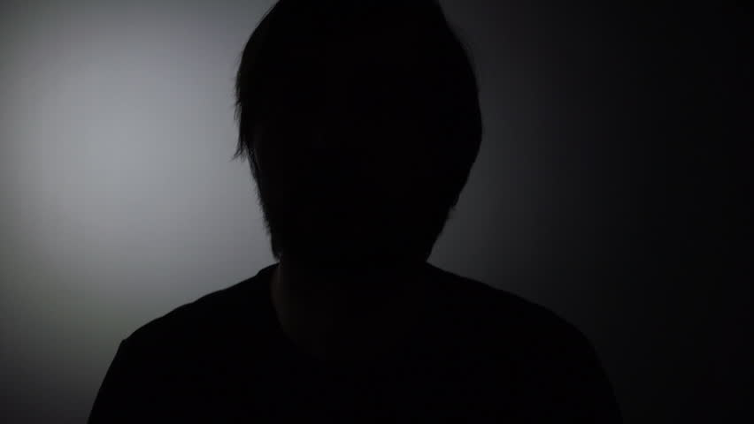

# Image classifier
Simple image classifier, that decides whether an image is light or dark.

## Technologies
Project is created with:
* scala version: 2.13.8
* akka library version: 2.6.14
* circe library version: 0.14.1

## Setup
To run this project, go to current project directory and run using:

``
$ sbt run
``

## Description

The project uses config contained in `config.json` file in `resources` directory, where are specified `input` and `output` directories for images to be classified. The default directories are set as `in` and `out` directories in the `resources` in the project, but it will work for any path to existing directories.

In the `in` directory contains all the images attached to the task. Images with label `1` should be classified as `dark` and the images with label `2` as `bright`.

The perceived brightness is calculated from this formula:

``
sqrt(0.299 * R^2 + 0.587 * G^2 + 0.114 * B^2)
``

The cut-off point is set for `25`, that allows to correctly classified `100%` of provided images.

## Sample dark image

Label: `dark`

Score: `15`

## Sample bright image

Label: `bright`

Score `34`